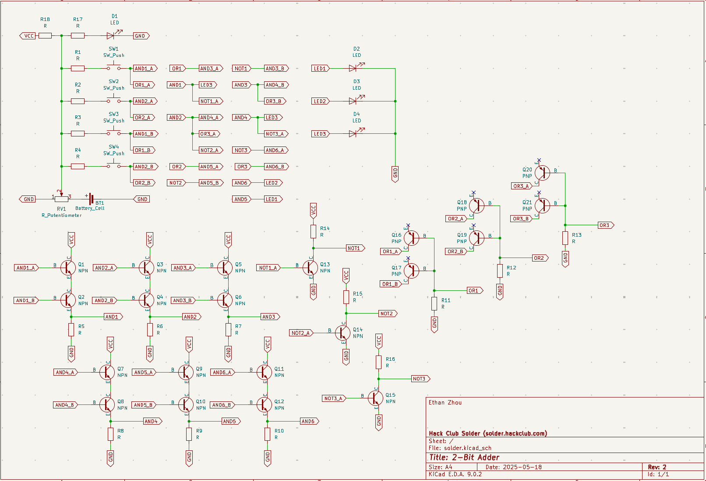
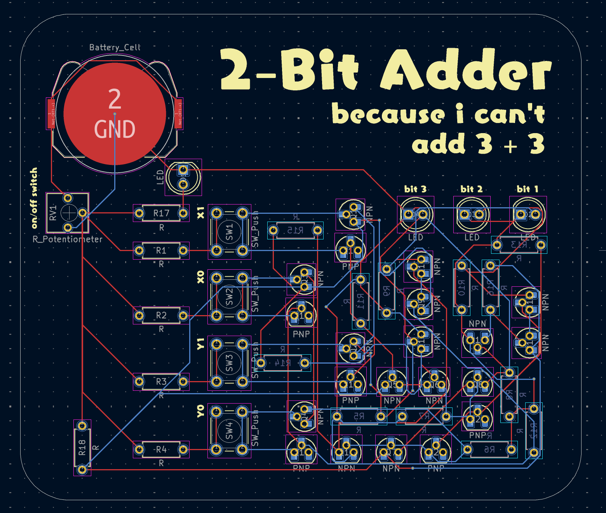
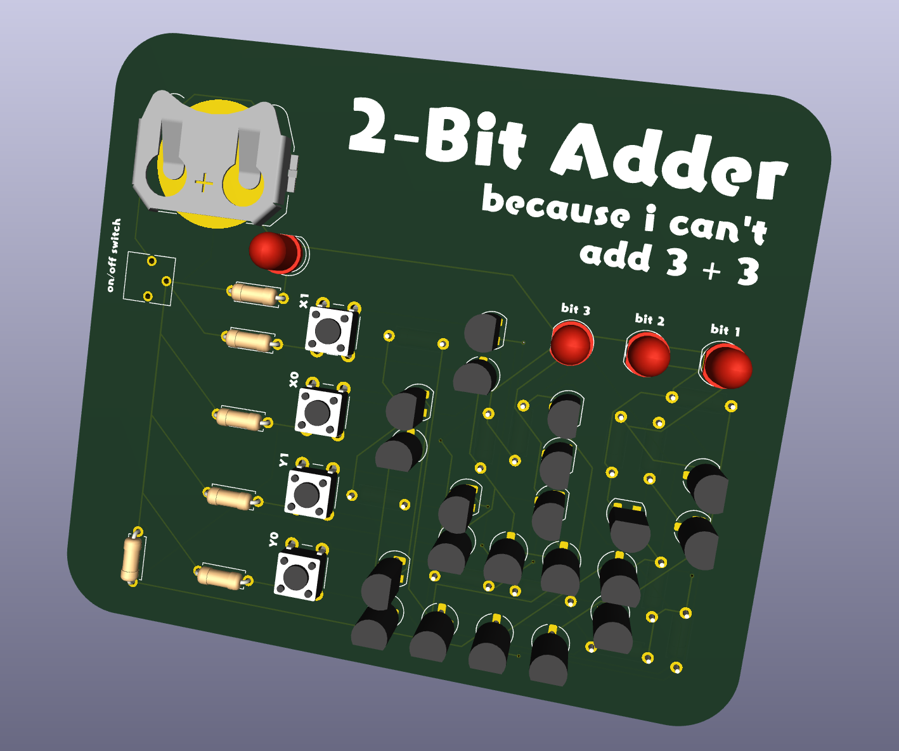

# A 2-Bit Adder - *solder*
A poorly made PCB that is only slightly smarter than a goldfish. Ever wished to know the answer to life, the universe, and everything? Well this certainly can't tell you, but it can tell you what 3 + 3 is! Cool!

## Schematic

## PCB

## Features
- Won't explode/spontaneously combust*!
- Can add 2 numbers up to 3*!
- Turn on and off with potentiometer*!
- "Clean and neat" wiring on PCB*!

**probably*

## BOM
- 1 	Battery holder
- 6 	PNP Transistor
- 15	NPN Transistor
- 18  220k Resistor
- 1 	Potentiometer
- 4 	Push Button
- 4   LED

---

I do not assume any responsibility for any damage caused by using this PCB. 

Made by `@Ethan Zhou` as a part of https://solder.hackclub.com!
